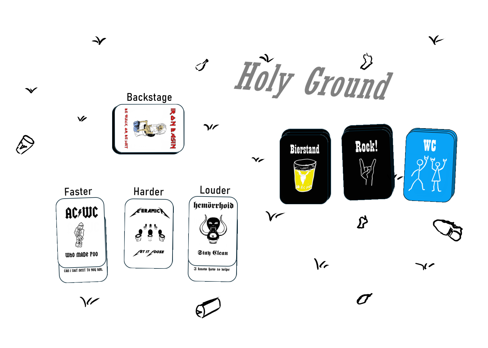

+++
date = "2024-10-16"
draft = false
+++
<h1 id="faq">FAQs:</h1>
<details>
   

<summary>Tips for collapsed sections</summary>

### You can add a header

You can add text within a collapsed section. 
You can add an image or a code block, too.
   
   
   
- Wie du die Bühnen und den Backstage-Bereich auslegst, wird [hier](../tutorials/#buehne) beschrieben
- Zum Seitenanfang kommst du [hier](#leg-die-karten-so-aus)
```ruby
   puts "Hello World"
```

</details>
